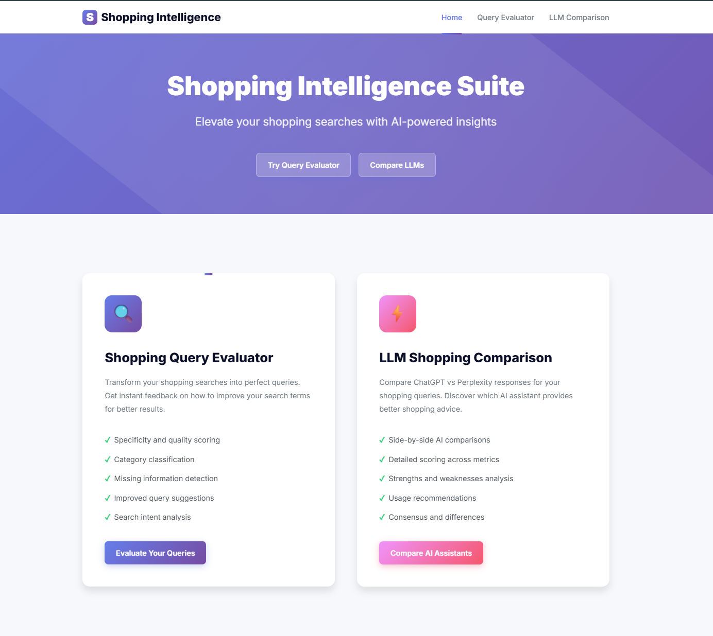
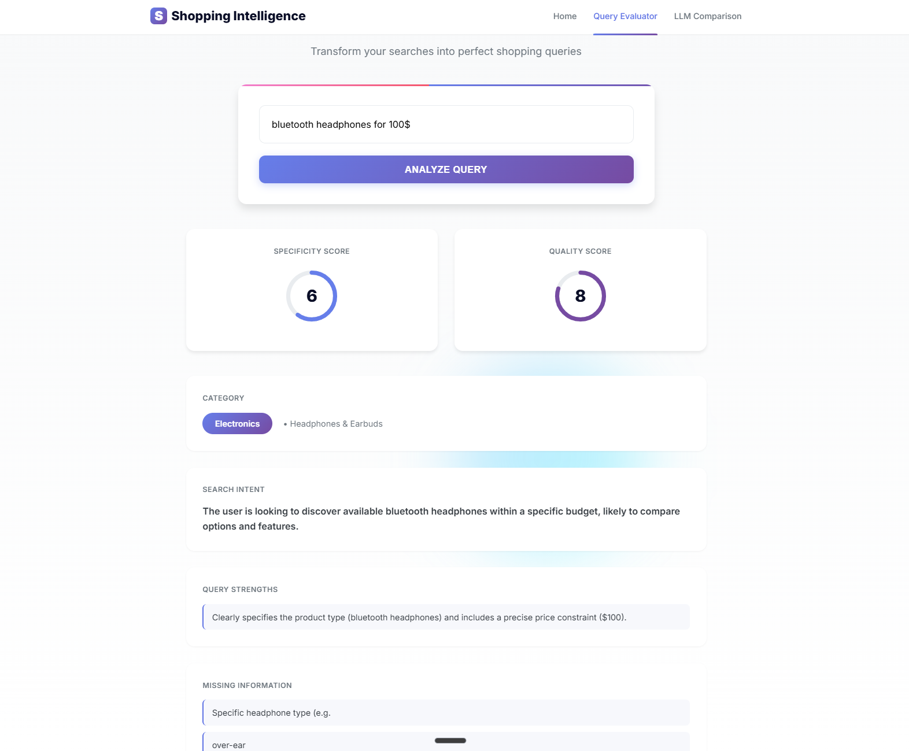
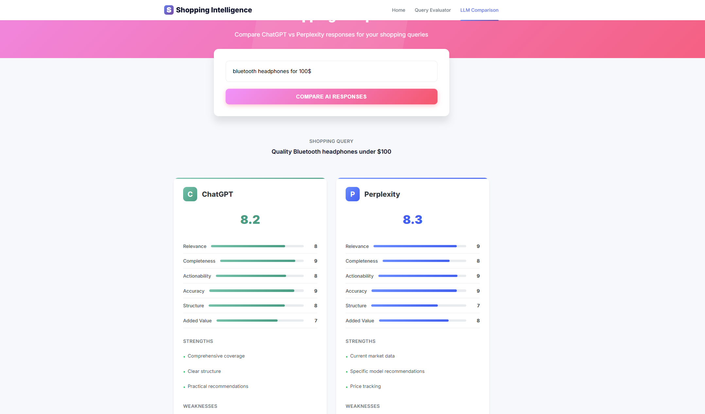

# Shopping Query Analyzer 🛍️

A powerful Flask web application that helps you optimize your shopping searches with AI-powered insights. Features two innovative tools to elevate your online shopping experience.



## 🚀 Features

### 🔍 Shopping Query Evaluator
Analyze and improve your shopping search queries with instant feedback:
- **Specificity & Quality Scoring** - Get numerical scores for your query effectiveness
- **Smart Category Classification** - Automatically categorizes your shopping intent
- **Missing Information Detection** - Identifies what details could improve your search
- **AI-Powered Query Suggestions** - Get optimized versions of your queries
- **Search Intent Analysis** - Understand whether you're browsing, comparing, or ready to buy



### ⚡ LLM Shopping Comparison
Compare how ChatGPT and Perplexity respond to your shopping queries:
- **Side-by-Side AI Comparisons** - See both responses in one view
- **Detailed Scoring Metrics** - Compare relevance, completeness, accuracy, and more
- **Strengths & Weaknesses Analysis** - Understand what each AI does best
- **Smart Usage Recommendations** - Learn when to use which AI assistant
- **Consensus & Differences** - See where AIs agree and where they diverge



## 🛠️ Tech Stack

- **Backend**: Flask (Python 3.7+)
- **Frontend**: Vanilla JavaScript, HTML5, CSS3
- **Styling**: Custom CSS with modern gradients and animations
- **API Integration**: n8n webhooks for real-time processing
- **Design**: Clean, professional interface with smooth animations

## 📋 Prerequisites

- Python 3.7 or higher
- n8n workflows running locally with active webhooks
- Modern web browser (Chrome, Firefox, Safari, Edge)

## 🔧 Installation

1. **Clone the repository**
```bash
git clone https://github.com/Nraitschew/shopping_query_analyzer.git
cd shopping_query_analyzer
```

2. **Install Python dependencies**
```bash
pip install -r requirements.txt
```

## 🚀 Running the Application

1. **Ensure n8n workflows are running**
   - The application requires two n8n webhook endpoints to be active
   - Update webhook URLs in `app.py` if needed

2. **Start the Flask server**
```bash
python app.py
```

3. **Open your browser**
```
http://localhost:5000
```

## ⚙️ Configuration

### Webhook URLs
The application uses two n8n webhook endpoints configured in `app.py`:

```python
QUERY_EVALUATOR_WEBHOOK = "http://0.0.0.0:5678/webhook/5063a70b-f51b-4a3a-b4ca-414143e36845"
LLM_COMPARISON_WEBHOOK = "http://0.0.0.0:5678/webhook/553c16ba-1923-464a-a318-878470bb24da"
```

**Note for WSL users**: Update these URLs based on your setup:
- **WSL**: Use the gateway IP (run `ip route | grep default` to find it)
- **Local Windows**: Use `localhost` or `127.0.0.1`
- **Docker**: Use the container's IP address
- **Remote server**: Use the server's IP or domain

## 💡 Usage Guide

### Using the Query Evaluator
1. Navigate to the Query Evaluator from the home page
2. Enter any shopping query (e.g., "wireless headphones for running")
3. Click "Analyze Query" to get instant feedback
4. Review scores, suggestions, and missing information
5. Use the improved query suggestion for better search results

### Using the LLM Comparison
1. Navigate to LLM Comparison from the home page
2. Enter a shopping query you want both AIs to answer
3. Click "Compare AI Responses" to see side-by-side analysis
4. Review detailed scores and recommendations
5. Use insights to choose the best AI for your shopping needs

## 🐛 Troubleshooting

### Webhook Connection Issues
- Verify n8n is running: Check if you can access n8n's web interface
- Test webhook directly: Use curl or Postman to test the webhook endpoints
- Check firewall: Ensure ports are open for webhook communication

### WSL-Specific Issues
- Find correct host IP: Run `ip route | grep default` in WSL
- Update app.py with the correct IP address
- Ensure Windows firewall allows WSL connections

### General Issues
- **Port already in use**: Change Flask port in `app.py` (default: 5000)
- **Module not found**: Reinstall dependencies with `pip install -r requirements.txt`
- **No response from webhooks**: Check n8n workflow execution logs
- **Browser console errors**: Open developer tools for detailed error messages

## 📝 API Response Formats

### Query Evaluator Response
```json
{
  "specificity_score": 8,
  "quality_score": 7,
  "category": "Electronics",
  "subcategory": "Audio",
  "missing_information": ["brand preference", "price range"],
  "strengths": ["clear product type", "specific use case"],
  "improvement_advice": "Add budget and preferred features",
  "improved_query_suggestion": "wireless running headphones under $150 with noise cancellation",
  "search_intent": "compare"
}
```

### LLM Comparison Response
```json
{
  "shopping_query": "best laptop for programming",
  "chatgpt_evaluation": {
    "scores": {
      "relevance": 9,
      "completeness": 8,
      "overall_score": 8.5
    },
    "strengths": ["comprehensive", "well-structured"],
    "weaknesses": ["lacks current prices"]
  },
  "perplexity_evaluation": {
    "scores": {
      "relevance": 8,
      "completeness": 9,
      "overall_score": 8.3
    },
    "strengths": ["current data", "source citations"],
    "weaknesses": ["less detailed explanations"]
  },
  "direct_comparison": {
    "winner": "ChatGPT",
    "winning_margin": 0.2,
    "winning_rationale": "More comprehensive technical details"
  }
}
```

## 🤝 Contributing

Contributions are welcome! Please feel free to submit a Pull Request. For major changes, please open an issue first to discuss what you would like to change.

## 📄 License

This project is open source and available under the [MIT License](LICENSE).

## 🙏 Acknowledgments

- Built with Flask and modern web technologies
- Powered by n8n workflow automation
- UI inspired by modern design principles
- AI comparison powered by ChatGPT and Perplexity APIs

---

Made with ❤️ for better shopping experiences